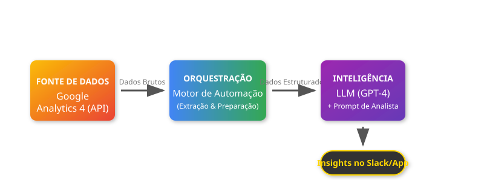

# System Architecture

The following diagram illustrates the data flow and components of the GA4 Analyst system.

## Components

1.  **Data Source**: Google Analytics 4 (API) provides raw data.
2.  **Orchestration**: An automation engine extracts and prepares the data.
3.  **Intelligence**: An LLM (GPT-4) with an Analyst Prompt processes the structured data.
4.  **Output**: Insights are delivered via Slack or App.
